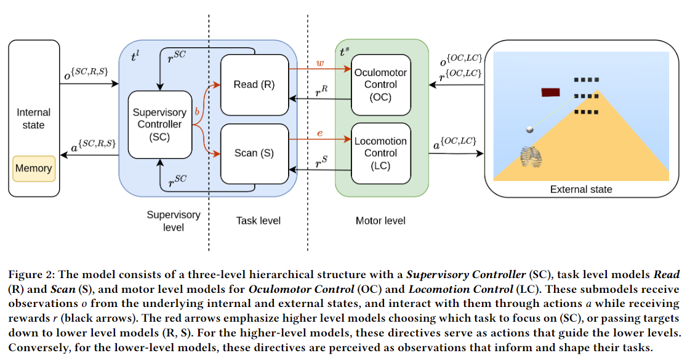

<!-- ```python
from IPython.core.display import Image
Image('https://www.python.org/static/community_logos/python-logo-master-v3-TM-flattened.png')
``` -->

    
<!--  -->
    

<!-- ```python
print("Welcome to Academic!")
``` -->

<!-- ## Organize your notebooks

Place the notebooks that you would like to publish in a `notebooks` folder at the root of your website.

## Import the notebooks into your site

```bash
pipx install academic
academic import 'notebooks/**.ipynb' content/post/ --verbose
``` -->

<!-- The notebooks will be published to the folder you specify above. In this case, they will be published to your `content/post/` folder. -->

We propose a novel computationally rational model that features modeling users' attention switch when multitasking, especially in the context of reading on OHMDs while walking. We develop a hierarchical reinforcement learning architecture to capture users' key cognitive processes and realize them in a physics engine called MuJoCo. The model successfully replicates user behaviors, including attention switch, walking speed control, and reading. Please see our paper for more details! 

Codes will also be available here: https://github.com/Synteraction-Lab/heads-up-multitasker
